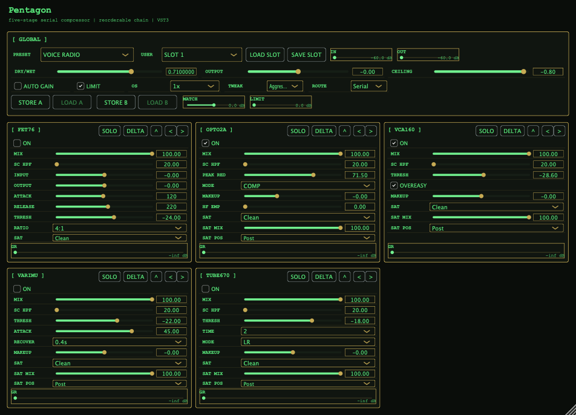

# Pentagon



---

`Pentagon` is a JUCE-based VST3 dynamics plugin implementing the five-stage serial compressor described in [`reference/specs.md`](/home/matteo/Documents/prog/vst/5dita_2/reference/specs.md) and [`reference/specs_long.md`](/home/matteo/Documents/prog/vst/5dita_2/reference/specs_long.md).

Implemented features:

- Five compressor stages: `FET76`, `OPTO2A`, `VCA160`, `VARIMU`, `TUBE670`
- Serial, parallel, and hybrid stage routing
- Per-stage enable, mix, sidechain HPF, parameter controls, saturation mode/placement, and GR meter
- Reorderable chain with persistent stage order
- Global `Dry/Wet`, `Output`, `Ceiling`, lookahead limit, deferred oversampling switching, `Tweak`, and preset controls
- Input/output metering
- Oversampled wet path with dry-path latency compensation
- Stage `SOLO` / `DELTA` audition modes, collapsible cards, drag reordering, and A/B plus user preset slots
- Linux, macOS, and Windows VST3 build targets

## Requirements

- CMake `>= 3.22`
- C++20 compiler
- JUCE `8.0.7`
- Linux development packages for ALSA, OpenGL, Freetype, Fontconfig, and GTK/WebKit if you build with JUCE FetchContent

## Build

The examples below use half the available CPU cores for the build job count.

If `JUCE_DIR` is available locally:

```bash
cmake -S . -B build -DJUCE_DIR=/path/to/JUCE
jobs=$(( $(nproc) / 2 ))
[ "$jobs" -lt 1 ] && jobs=1
cmake --build build --config Release -j"$jobs"
```

Otherwise the project can fetch JUCE automatically during configure:

```bash
cmake -S . -B build
jobs=$(( $(nproc) / 2 ))
[ "$jobs" -lt 1 ] && jobs=1
cmake --build build --config Release -j"$jobs"
```

Built artifact on Linux:

```text
build/Pentagon_artefacts/VST3/Pentagon.vst3
```

Main binary inside the bundle:

```text
build/Pentagon_artefacts/VST3/Pentagon.vst3/Contents/x86_64-linux/Pentagon.so
```

## Releases

GitHub Actions builds and publishes Linux, macOS, and Windows VST3 bundles when a tag matching `v*` is pushed.

Example:

```bash
git tag v0.1.0
git push origin v0.1.0
```

That workflow:

- installs the Linux JUCE build dependencies
- builds the `Pentagon` VST3 target on Ubuntu, macOS, and Windows runners
- zips the `Pentagon.vst3` bundle on each platform
- attaches all three zip files to the GitHub release for that tag

## Highlights

- `FET76` exposes the classic `1176` ratios: `4:1`, `8:1`, `12:1`, `20:1`
- All saturating stages expose both a saturation mode selector and a `SAT MIX` control
- `TUBE670` supports `LR` and `MS` stereo modes
- Presets persist stage order alongside per-stage parameter values
- Oversampling changes are deferred until a safe/silent block instead of hard-switching mid-audio
- The output stage now uses slower loudness matching plus a lookahead ceiling limiter

## Validation

An optional JUCE smoke-test target is included:

```bash
cmake -S . -B build -DPENTAGON_BUILD_TESTS=ON
cmake --build build --config Release --target PentagonSmokeTests
ctest --test-dir build --output-on-failure
```

It covers chain-order roundtrips, state restore, user preset slot persistence, supported layouts, and a real audio-block pass.

## Project Layout

- [`CMakeLists.txt`](/home/matteo/Documents/prog/vst/5dita_2/CMakeLists.txt): JUCE plugin target and build configuration
- [`Source/PluginProcessor.cpp`](/home/matteo/Documents/prog/vst/5dita_2/Source/PluginProcessor.cpp): DSP graph, oversampling, dry/wet, safety, state, presets
- [`Source/StageProcessors.h`](/home/matteo/Documents/prog/vst/5dita_2/Source/StageProcessors.h): stage-specific compressor implementations
- [`Source/PluginEditor.cpp`](/home/matteo/Documents/prog/vst/5dita_2/Source/PluginEditor.cpp): retro UI, meters, preset/global controls, stage cards
- [`docs/implementation.md`](/home/matteo/Documents/prog/vst/5dita_2/docs/implementation.md): implementation notes and tradeoffs
